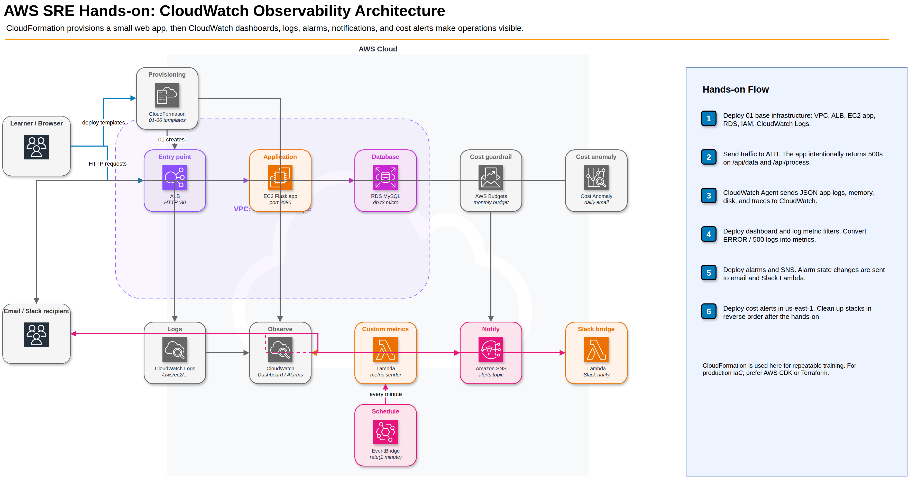

# ハンズオン構成図

このハンズオンは、CloudFormationで小さなWebアプリ環境を作り、CloudWatchでメトリクス・ログ・アラーム・通知を順番に確認する教材です。実運用のIaCではCDKまたはTerraformを推奨しますが、このリポジトリでは受講者が再現しやすいようにCloudFormationを使います。

## 全体構成

- draw.io版: [architecture.drawio](./architecture.drawio)
- PNG版: [architecture.png](./architecture.png)
- 手順全体: [HANDSON_FLOW.md](./HANDSON_FLOW.md)
- CloudWatchの見方: [CLOUDWATCH_GUIDE.md](./CLOUDWATCH_GUIDE.md)
- ログとメトリクスの読み取り例: [SIGNAL_EXAMPLES.md](./SIGNAL_EXAMPLES.md)

## 構成図プレビュー



## スタック別に作成されるもの

| テンプレート | スタック名 | 主なリソース | 目的 |
|---|---|---|---|
| `01-base-infrastructure.yaml` | `sre-handson-base` | VPC, Public/Private Subnet, ALB, EC2, RDS, IAM Role, CloudWatch Logs LogGroup | 監視対象のWebアプリ基盤を作る |
| `02-cloudwatch-dashboard.yaml` | `sre-handson-dashboard` | CloudWatch Dashboard | EC2 / ALB / RDS の主要メトリクスを一覧化する |
| `03-custom-metrics.yaml` | `sre-handson-custom-metrics` | Lambda, EventBridge Rule, IAM Role | 1分ごとにサンプルのビジネスメトリクスを送る |
| `04-log-metric-filter.yaml` | `sre-handson-log-filter` | Logs Metric Filter | JSONログから `ErrorCount` と `HTTP5xxCount` を作る |
| `05-alarms-sns.yaml` | `sre-handson-alarms` | CloudWatch Alarm, SNS, Lambda | メトリクス悪化をメール/Slackへ通知する |
| `06-cost-alerts.yaml` | `sre-handson-cost` | AWS Budgets, Cost Anomaly Detection, SNS | 費用の上振れを通知する |

## リクエストの流れ

1. 受講者がALBのDNS名へHTTPアクセスします。
2. ALBがEC2上のFlaskアプリへリクエストを転送します。
3. アプリは `/`, `/api/data`, `/api/process` を返します。
4. `/api/data` は約20%、`/api/process` は約15%の確率でHTTP 500を返します。
5. アプリは `/var/log/todo-app.log` にJSONログを書きます。
6. CloudWatch Agentがログ、メモリ、ディスク、X-RayトレースをCloudWatchへ送ります。

## 監視データの流れ

| データ | 発生元 | 送信先 | 確認先 |
|---|---|---|---|
| ALBリクエスト数 / 5xx / レイテンシ | ALB | CloudWatch Metrics | Dashboard / Alarm |
| EC2 CPU | EC2 | CloudWatch Metrics | Dashboard / Alarm |
| EC2メモリ / ディスク | CloudWatch Agent | `CWAgent` namespace | Dashboard |
| JSONアプリログ | Flaskアプリ | CloudWatch Logs | Logs Insights / Metric Filter |
| App ErrorCount | Logs Metric Filter | `SREHandson/App` namespace | Alarm |
| ActiveUsers / OrderCount | Lambda | `SREHandson/Business` namespace | Metrics |
| コスト | AWS Billing | Budgets / Cost Anomaly Detection | Email |

## 後続スタックへ渡す値

`02-cloudwatch-dashboard.yaml` と `05-alarms-sns.yaml` は、`01-base-infrastructure.yaml` のOutputsを使います。

```bash
INSTANCE_ID=$(aws cloudformation describe-stacks \
  --stack-name sre-handson-base \
  --region ap-northeast-1 \
  --query "Stacks[0].Outputs[?OutputKey=='AppInstanceId'].OutputValue" \
  --output text)

ALB_FULL_NAME=$(aws cloudformation describe-stacks \
  --stack-name sre-handson-base \
  --region ap-northeast-1 \
  --query "Stacks[0].Outputs[?OutputKey=='ALBFullName'].OutputValue" \
  --output text)
```

`ALBFullName` は `app/sre-handson-alb/xxxxxxxx` の形式で、CloudWatchの `AWS/ApplicationELB` メトリクスに必要です。

## 注意点

- `06-cost-alerts.yaml` だけは `us-east-1` にデプロイします。
- RDS `db.t3.micro` は起動中に費用が発生します。
- ハンズオン終了後は、番号の逆順にスタックを削除してください。
